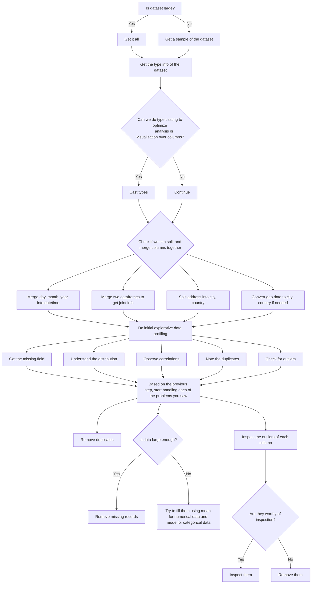

```mermaid
flowchart TD
    A[Is dataset large?]
    A -->|Yes| B[Get it all]
    A -->|No| C[Get a sample of the dataset]
    B --> D[Get the type info of the dataset]
    C --> D[Get the type info of the dataset]

    D --> E{Can we do type casting to optimize 
        analysis or visualization over columns?}
    E -->|Yes| F[Cast types]
    E -->|No| G[Continue]

    F --> H{Check if we can split and merge columns together}
    G --> H{Check if we can split and merge columns together}

    H --> I[Merge day, month, year into datetime]
    H --> J[Merge two dataframes to get joint info]
    H --> K[Split address into city, country]
    H --> L[Convert geo data to city, country if needed]

    I --> M[Do initial explorative data profiling]
    J --> M[Do initial explorative data profiling]
    K --> M[Do initial explorative data profiling]
    L --> M[Do initial explorative data profiling]

    M --> N[Get the missing field]
    M --> O[Understand the distribution]
    M --> P[Observe correlations]
    M --> Q[Note the duplicates]
    M --> R[Check for outliers]

    N --> S[Based on the previous step, start handling each of the problems you saw]
    O --> S[Based on the previous step, start handling each of the problems you saw]
    P --> S[Based on the previous step, start handling each of the problems you saw]
    Q --> S[Based on the previous step, start handling each of the problems you saw]
    R --> S[Based on the previous step, start handling each of the problems you saw]

    S --> T[Remove duplicates]
    S --> U{Is data large enough?}
    U -->|Yes| V[Remove missing records]
    U -->|No| W[Try to fill them using mean for numerical data and mode for categorical data]
    S --> X[Inspect the outliers of each column]
    X --> Y{Are they worthy of inspection?}
    Y -->|Yes| Z[Inspect them]
    Y -->|No| AA[Remove them]
```
